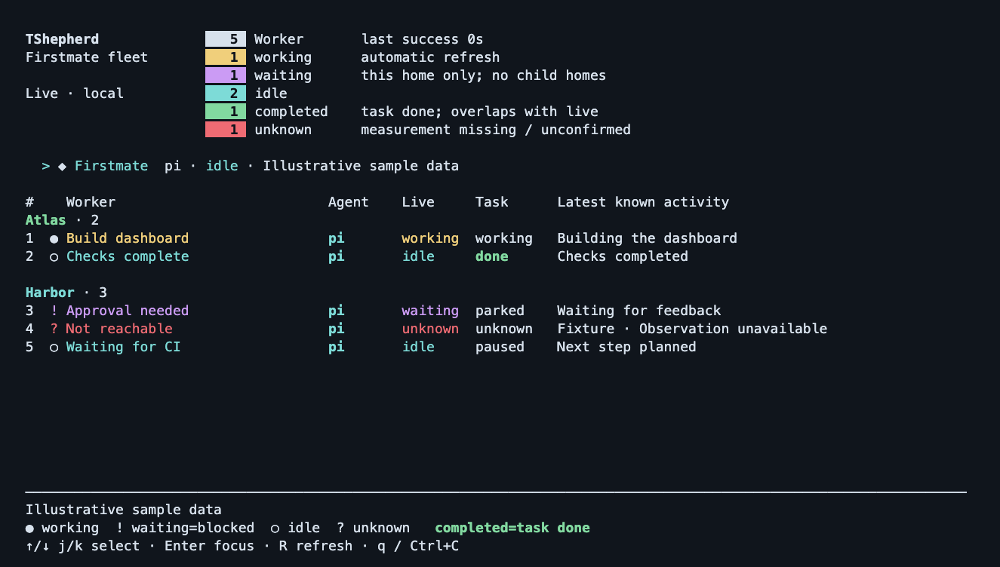

# TShepherd

A local terminal dashboard for [Firstmate](https://github.com/kunchenguid/firstmate),
running inside a Herdr tab. TShepherd requires an existing Firstmate installation.
See workers grouped by project, their live activity, task status, and latest update.
Select a worker or Firstmate itself and press **Enter** to switch to its tab.
TShepherd does not create or manage tasks.



*Illustrative, fully synthetic sample data — no real workers or private fleet data.*

## Requirements

- **macOS** for the full experience, including switching to Firstmate itself.
- **Python 3.9+ with curses** and **Git**. No additional Python packages needed.
- An existing [Firstmate](https://github.com/kunchenguid/firstmate) installation with its fleet snapshot command
  (`fm-fleet-snapshot.v1`) and dependencies, including **Bash** and **jq**.
- A running **Herdr** session with a matching `herdr` CLI on your `PATH`.
  Verified with Herdr **0.9.0 / protocol 22**.

## Install and run

Clone the source:

```sh
git clone https://github.com/webtom-ux/tshepherd.git "$HOME/TShepherd"
```

Run inside a Herdr terminal tab, replacing the two example paths:

```sh
python3 "$HOME/TShepherd/tshepherd.py" \
  --fm-home "/path/to/firstmate-home" \
  --firstmate-root "/path/to/firstmate-code"
```

`--fm-home` points to your Firstmate data directory; `--firstmate-root` points to
its source checkout. They may be the same directory. Both must be supplied.
If the Herdr CLI is not on your `PATH`, add `--herdr "/path/to/herdr"`.

## Launch with just `TShepherd`

Add this function to `~/.zshrc`. Adjust the script path if you cloned elsewhere,
and replace both Firstmate paths with your own:

```sh
TShepherd() {
  python3 "$HOME/TShepherd/tshepherd.py" \
    --fm-home "/path/to/firstmate-home" \
    --firstmate-root "/path/to/firstmate-code" "$@"
}
```

Reload your shell configuration, then launch from any directory in a Herdr tab:

```sh
source ~/.zshrc
TShepherd
```

For Bash, put the same function in `~/.bashrc` and reload it with `source ~/.bashrc`.

The interface defaults to English. The function forwards options to TShepherd:

```sh
TShepherd --lang de  # German
TShepherd --lang en  # English (default)
```

Only interface labels are translated; project names, task text and source status
values are kept as reported.

Use **↑/↓** or **j/k** to select, **Enter** to switch tabs, **R** to refresh,
and **q** or **Ctrl+C** to quit. Live activity and task completion are separate;
`unknown` means the current live state could not be confirmed.
